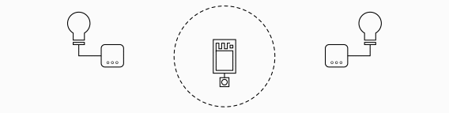
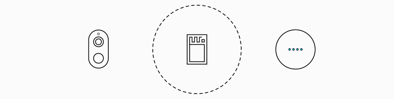
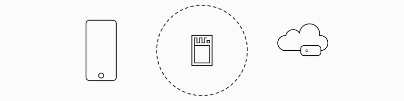

# The Approximate Library
The Approximate library is a WiFi [Arduino](http://www.arduino.cc/download) Library for building proximate interactions between your Internet of Things and the [ESP8266](https://en.wikipedia.org/wiki/ESP8266) or [ESP32](https://en.wikipedia.org/wiki/ESP32), perhaps a switch that operates the nearest lamp or a song that plays when you (and your phone) come home.



Technically this library makes it easy to use WiFi signal strength ([RSSI](https://en.wikipedia.org/wiki/Received_signal_strength_indication)) to estimate the physical distance to a device on your home network, then obtain its [MAC address](https://en.wikipedia.org/wiki/MAC_address) and optionally its [IP address](https://en.wikipedia.org/wiki/IPv4). The network activity of these devices can also be observed.

## Installation

The latest stable release of Approximate is available in the Arduino IDE Library Manager - search for "Approximate". Click install.

Alternatively, Approximate can be installed manually. First locate and open the `libraries` directory used by the Arduino IDE, then clone this repository (https://github.com/davidchatting/Approximate) into that folder - this will create a new subfolder called `Approximate`.

Approximate requires that either the Arduino core for the ESP8266 or ESP32 is installed - follow these instructions:

* ESP8266 - https://github.com/esp8266/Arduino#installing-with-boards-manager
* ESP32 - https://github.com/espressif/arduino-esp32/blob/master/docs/arduino-ide/boards_manager.md

In addition, the following libraries are also required:

* ListLib - https://github.com/luisllamasbinaburo/Arduino-List (install via the Arduino IDE Library Manager - searching for "ListLib")

## Limitations
Approximate works with 2.4GHz WiFi networks, but not 5GHz networks - neither ESP8266 or ESP32 support this technology. This means that devices that are connected to a 5GHz WiFi network will be invisible to this library. Approximate will not work as expected where [MAC address randomisation](https://support.apple.com/en-gb/guide/security/secb9cb3140c/web) is enabled - the default iOS setting.

## Examples
This section describes in some technical detail each of the examples available from the `Examples` menu once Approximate is correctly installed.

Every Approximate sketch has this essential structure:

```
#include <Approximate.h>
Approximate approx;

void setup() {
    if (approx.init("MyHomeWiFi", "password")) {
        approx.begin();
    }
}

void loop() {
    approx.loop();
}
```

Approximate defines two types of interaction with devices: when in proximity (using a Proximate Device Handler) or simply when active (using an Active Device Handler). The examples here demonstrate combinations of these.

### When We're Close... using a Proximate Device Handler


The [CloseBy example](examples/CloseBy) indicates when a WiFi device is in proximity and prints out its [MAC addresses](https://en.wikipedia.org/wiki/MAC_address).

```
#include <Approximate.h>
Approximate approx;

const int LED_PIN = 2;

void setup() {
    Serial.begin(9600);
    pinMode(LED_PIN, OUTPUT);

    if (approx.init("MyHomeWiFi", "password")) {
        approx.setProximateDeviceHandler(onProximateDevice, APPROXIMATE_PERSONAL_RSSI);
        approx.begin();
    }
}

void loop() {
    approx.loop();
}

void onProximateDevice(Device *device, Approximate::DeviceEvent event) {
    switch(event) {
        case Approximate::ARRIVE:
            digitalWrite(LED_PIN, HIGH);
            Serial.println("ARRIVE\t" + device->getMacAddressAsString());
            break;
        case Approximate::DEPART:
            digitalWrite(LED_PIN, LOW);
            Serial.println("DEPART\t" + device->getMacAddressAsString());
            break;
    }
}
```

This example uses a Proximate Device Handler. The `onProximateDevice()` callback function receives both a pointer to a `Device` and a `DeviceEvent` for each new observation - in this example the events `ARRIVE` and `DEPART` cause the device's [MAC address](https://en.wikipedia.org/wiki/MAC_address) to be printed out and the state to be indicated via the LED. MAC addresses are the primary way in which the Approximate library identifies network devices.

There are four event types that a `DeviceHandler` will encounter: 

* `Approximate::ARRIVE` once when the device first arrives in proximity (only for Proximate Device Handlers)
* `Approximate::DEPART` once when the device departs and is no longer seen in proximity (only for Proximate Device Handlers)
* `Approximate::SEND` every time the device sends (uploads) data
* `Approximate::RECEIVE` every time the device receives (downloads) data (rarely for Proximate Device Handlers, unless the router is also in proximity)

The Proximate Device Handler is set by `setProximateDeviceHandler()`, which takes a `DeviceHandler` callback function parameter (here `onProximateDevice`) and a value for the `rssiThreshold` parameter that describes range considered to be in proximity (here `APPROXIMATE_PERSONAL_RSSI`). [RSSI](https://en.wikipedia.org/wiki/Received_signal_strength_indication) is a measure of WiFi signal strength used to estimate proximity. It is measured in [dBm](https://en.wikipedia.org/wiki/DBm) and at close proximity (where the reception is good) its value will approach zero, as the signal degrades over distance and through objects and walls, the value will fall. For instance, an RSSI of -50 would represent a relatively strong signal. The library predefines four values of `rssiThreshold` for use, that borrow from the language of [proxemics](https://en.wikipedia.org/wiki/Proxemics):

* `APPROXIMATE_INTIMATE_RSSI` -20 dBm (10 centimetres)
* `APPROXIMATE_PERSONAL_RSSI` -40 dBm (1 metre)
* `APPROXIMATE_SOCIAL_RSSI`   -60 dBm (4 metres)
* `APPROXIMATE_PUBLIC_RSSI`   -80 dBm (8 metres)

These values are extremely approximate and represent the highest values that might be achieved at these ranges. `rssiThreshold` can be defined numerically and if it is not set `setProximateDeviceHandler()` defaults to a value of `APPROXIMATE_PERSONAL_RSSI`. The full definition for `setProximateDeviceHandler()` is:

```
void setProximateDeviceHandler(DeviceHandler deviceHandler, int rssiThreshold = APPROXIMATE_PERSONAL_RSSI, int lastSeenTimeoutMs = 60000);
```

The parameter `lastSeenTimeoutMs` defines how quickly (in milliseconds) a device will be said to `DEPART` if it is unseen. While the `ARRIVE` event is triggered only once for a device, further observations will cause `SEND` and (sometimes) `RECEIVE` events; when these events stop and after a wait of `lastSeenTimeoutMs`, a `DEPART` event will then be generated. A suitable value will depend on the dynamics of the application and devices' use of the network. One minute (60,000 ms) is the default value - that is used in this example.

### Find My...  using an Active Device Handler


The [FindMy example](examples/FindMy) demonstrates how a device can be found on your WiFi network using its signal strength (as measured by [RSSI](https://en.wikipedia.org/wiki/Received_signal_strength_indication)) - the LED flashing increases as the distance decreases.

```
#include <Approximate.h>
Approximate approx;

const int LED_PIN = 2;
bool ledState = LOW;
long ledToggleAtMs = 0;
int ledToggleIntervalMs = 0;

void setup() {
  Serial.begin(9600);
  pinMode(LED_PIN, OUTPUT);

  if (approx.init("MyHomeWiFi", "password")) {
    approx.setActiveDeviceFilter("XX:XX:XX:XX:XX:XX");
    approx.setActiveDeviceHandler(onActiveDevice);
    approx.begin();
  }
}

void loop() {
  approx.loop();

  digitalWrite(LED_PIN, ledState);
  
  if(ledToggleIntervalMs > 0 && millis() > ledToggleAtMs) {
    ledState = !ledState;
    ledToggleAtMs = millis() + ledToggleIntervalMs;
  }
}

void onActiveDevice(Device *device, Approximate::DeviceEvent event) {
  if(event == Approximate::SEND) {  
    ledToggleIntervalMs = map(device->getRSSI(), -100, 0, 1000, 0);
  }
}
```

This example uses an Active Device Handler. The `onActiveDevice()` callback function receives both a pointer to a `Device` and a `DeviceEvent` for each event. This example measures the RSSI of messages sent by the device (`event == Approximate::SEND`) to estimate its distance and displays this as a flashing LED, that speeds up as the distance decreases.

The Active Device Handler is set by `Approximate::setActiveDeviceHandler()`, taking a `DeviceHandler` callback function parameter (here `onActiveDevice`), then generating `SEND` and `RECEIVE` events for active devices. The full definition for `setActiveDeviceHandler()` is:

```
void setActiveDeviceHandler(DeviceHandler activeDeviceHandler, bool inclusive = true);
```

Unlike the Proximate Device Handler the Active Device Handler is not filtered by signal strength, but instead can be filtered by [MAC address](https://en.wikipedia.org/wiki/MAC_address) or by device manufacturer with an [OUI code](https://en.wikipedia.org/wiki/Organizationally_unique_identifier). To observe a specific device, as in this example, `setActiveDeviceFilter()` takes a MAC address formatted as an String (XX:XX:XX:XX:XX:XX). Similarly, the OUI code of a specific manufacturer can be used as a filter and these can be found [here](http://standards-oui.ieee.org/oui.txt). Alterantively, rather than a single filter, a list of filters can be maintained using the `addActiveDeviceFilter()` variant. `setActiveDeviceHandler()` takes an optional parameter `inclusive` that defines the behaviour if no filters are set, whether any device should initially be included (`true`) or excluded (`false`), by default it is inclusive. Once a filter is added this initial inclusive or exclusive behaviour is overwritten.

```
void setActiveDeviceFilter(String macAddress);
void setActiveDeviceFilter(int oui);

void addActiveDeviceFilter(String macAddress);
void addActiveDeviceFilter(int oui);
```

### Watch Device - using a Proximate Device Handler and an Active Device Handler



The [WatchDevice example](examples/WatchDevice) creates a temporary pair with a proximate device and then flashes the LED to show the amount of data (number of bytes) that device is receiving.

```
#include <Approximate.h>
Approximate approx;

const int LED_PIN = 2;
long ledOnUntilMs = 0;

void setup() {
  Serial.begin(9600);
  pinMode(LED_PIN, OUTPUT);

  if (approx.init("MyHomeWiFi", "password")) {
    approx.setProximateDeviceHandler(onProximateDevice, APPROXIMATE_INTIMATE_RSSI, /*lastSeenTimeoutMs*/ 1000);
    approx.setActiveDeviceHandler(onActiveDevice, /*inclusive*/ false);
    approx.begin();
  }
}

void loop() {
  approx.loop();
  digitalWrite(LED_PIN, millis() < ledOnUntilMs);
}

void onProximateDevice(Device *device, Approximate::DeviceEvent event) {
  switch (event) {
    case Approximate::ARRIVE:
      Serial.println("Watching:  " + device -> getMacAddressAsString());
      approx.setActiveDeviceFilter(device);
      break;
    case Approximate::DEPART:
      break;
  }
}

void onActiveDevice(Device *device, Approximate::DeviceEvent event) {
    if(event == Approximate::RECEIVE) {
      ledOnUntilMs = millis() + (device -> getPayloadSizeBytes()/10);
    }
}
```

This example uses both a Proximate Device Handler (`onProximateDevice()`) and an Active Device Handler (`onActiveDevice()`) acting in combination - both receives both a pointer to a `Device` and a `Approximate::DeviceEvent`. The Active Device Handler is initially set to exclude all devices and so `onActiveDevice()` will report no activity until a device is brought within proximity and a device filter is added via `onProximateDevice()`. Once the pair is made, activity will be monitored even when they are no longer in proximity. A new pair is established when a new device is then in proximity.

### Close By MQTT - make a connection to the cloud



The [CloseByMQTT example](examples/CloseByMQTT) makes a connection to the cloud when a device is in proximity, sending a message to an [MQTT](https://en.wikipedia.org/wiki/MQTT) server. It requires the [Arduino Client for MQTT](https://github.com/knolleary/pubsubclient) library - search for "pubsubclient" in the Arduino IDE Library Manager.

```
#include <Approximate.h>
#include <PubSubClient.h>

Approximate approx;

WiFiClient wifiClient;
PubSubClient mqttClient(wifiClient);

const int LED_PIN = 2;

void setup() {
  Serial.begin(9600);
  pinMode(LED_PIN, OUTPUT);

  if (approx.init("MyHomeWiFi", "password")) {
    approx.setProximateDeviceHandler(onProximateDevice);
    approx.begin([]() {
      mqttClient.setServer("192.168.XXX.XXX", 1883);
    });
  }
}

void loop() {
  approx.loop();
  mqttClient.loop();
}

void onProximateDevice(Device *device, Approximate::DeviceEvent event) {
  if(event == Approximate::ARRIVE || event == Approximate::DEPART) {
    digitalWrite(LED_PIN, event == Approximate::ARRIVE);

    String json = "{\"" + device->getMacAddressAsString() + "\":\"" + Approximate::toString(event) + "\"}";
    Serial.println(json);
    
    approx.onceWifiStatus(WL_CONNECTED, [](String payload) {
      mqttClient.connect(WiFi.macAddress().c_str());
      mqttClient.publish("closeby", payload.c_str(), false); //false = don't retain message
      
      #if defined(ESP8266)
        delay(20);
        approx.disconnectWiFi();
      #endif
    }, json);
    approx.connectWiFi();
  }
}
```

This example is an extension to the CloseBy example and retains the same structure. However, its use of the network for MQTT messages requires that the WiFi status be managed. In `setup()`, when the `Approximate::begin()` function is called, if the connection can be successfully established `WiFi.status()` will achieve a state of `WL_CONNECTED` at which point network calls may be made. However, this status change will take some time and happens asynchronously. To manage this, `Approximate::begin()` takes an optional lambda function called once the connection is established and used here to set the MQTT server details. The ESP8266 must then break this connection to monitor devices and then reconnect to make network calls, unlike the ESP32 which can maintain the connection and monitor devices; the Approximate library provides a mechanism that manages both cases - namely `Approximate::onceWifiStatus()`. Like `Approximate::begin()` takes a lambda function, but it also takes a status on which this behaviour will be triggered. The function will be called at most once, if the WiFi status is immediately available or once this transition is next made.

In its simplest form `Approximate::onceWifiStatus()` is used as shown below - the subsequent call to `approx.connectWiFi()` is made to establish the trigger WiFi status of `WL_CONNECTED` - if it is not already available.

```
  approx.onceWifiStatus(WL_CONNECTED, []() {
    Serial.println("The WiFi is connected!");
  });
  approx.connectWiFi();
```

The CloseByMQTT example demonstrates how `Approximate::onceWifiStatus()` can pass a parameter - here `onProximateDevice()` defines a json `String` that contains the details of the MQTT message - a `bool` parameter is also supported. Note that for an ESP8266 the WiFi must then be disconnected once the MQTT message is sent `Approximate::disconnectWiFi()`, to allow monitoring to resume.

### Close By Sonoff - interacting with devices


The [CloseBySonoff example](examples/CloseBySonoff) demonstrates an interaction with a proximate device - namely the [Sonoff BASICR3](https://sonoff.tech/product/wifi-diy-smart-switches/basicr3) smart switch. In [DIY Mode](http://developers.sonoff.tech/sonoff-diy-mode-api-protocol.html) these devices offer a simple RESTful API, enabling the state of the socket to be set via an HTTP POST and json formatted payload. This example requires the [AceButton](https://github.com/bxparks/AceButton) library - available via the Arduino IDE Library Manager.

```
#include <Approximate.h>
Approximate approx;

#include <HTTPClient.h>

#include <AceButton.h>
using namespace ace_button;

const int LED_PIN = 2;
const int BUTTON_PIN = 0;
AceButton button(BUTTON_PIN);

Device *closeBySonoff = NULL;

void setup() {
  Serial.begin(9600);

  pinMode(LED_PIN, OUTPUT);
  digitalWrite(LED_PIN, false);

  ButtonConfig* buttonConfig = button.getButtonConfig();
  buttonConfig->setEventHandler(onButtonEvent);

  if (approx.init("MyHomeWiFi", "password", true)) {
    approx.setProximateDeviceHandler(onProximateDevice, APPROXIMATE_SOCIAL_RSSI, 10000);
    approx.begin();
  }
}

void loop() {
  approx.loop();
  button.check();
}

void onProximateDevice(Device *device, Approximate::DeviceEvent event) {
  switch (device->getOUI()) {
    //D8F15B Sonoff (Expressif Inc) - see: http://standards-oui.ieee.org/oui.txt
    case 0xD8F15B:
      onCloseBySonoff(device, event);
      break;
  }
}

void onCloseBySonoff(Device *device, Approximate::DeviceEvent event) {
  switch (event) {
    case Approximate::ARRIVE:
      closeBySonoff = device;
      digitalWrite(LED_PIN, HIGH);
      break;
    case Approximate::DEPART:
      if(*device == *closeBySonoff) {
        closeBySonoff = NULL;
        digitalWrite(LED_PIN, LOW);
      }
      break;
  }
}

void onButtonEvent(AceButton* button, uint8_t eventType, uint8_t buttonState) {
  if(closeBySonoff) {  
    switch (eventType) {
      case AceButton::kEventPressed:
        switchCloseBySonoff(true);
        break;
      case AceButton::kEventReleased:
        switchCloseBySonoff(false);
        break;
    }
  }
}

void switchCloseBySonoff(bool switchState) {
  if(closeBySonoff) {
    approx.onceWifiStatus(WL_CONNECTED, [](bool switchState) {
      if(closeBySonoff) {
        HTTPClient http;
        String url = "http://" + closeBySonoff->getIPAddressAsString() + ":8081/zeroconf/switch";
        http.begin(url);
        http.addHeader("Content-Type", "application/json");
      
        String switchValue = switchState?"on":"off";
        String httpRequestData = "{\"deviceid\": \"\",\"data\": {\"switch\": \"" + switchValue + "\"}}";
        
        int httpResponseCode = http.POST(httpRequestData);
        Serial.printf("%s\t%s\t%i\n",url.c_str(), httpRequestData.c_str(), httpResponseCode);
        http.end();
      }
      
      #if defined(ESP8266)
        delay(20);
        approx.disconnectWiFi();
      #endif
    }, switchState);
    approx.connectWiFi();
  }
}
```

This is a further extension to the CloseBy example and again retains the same structure. It uses a simple Proximate Device Handler (`onProximateDevice()`) and attempts to determine the type of the proximate device by its [OUI code](https://en.wikipedia.org/wiki/Organizationally_unique_identifier). Those identifying as `0xD8F15B` are manufactured by Expressif Inc, used by Sonoff (see http://standards-oui.ieee.org/oui.txt) - `onCloseBySonoff()` is then called. If the button is pressed and released `switchCloseBySonoff()` will be called to first turn on and then off a proximate Sonoff socket. The LED is illuminated to show that a device is present.

Significantly this example requires that not only a proximate device's MAC address be known, but also its local [IP address - IPv4](https://en.wikipedia.org/wiki/IPv4) be determined. In default operation IP addresses are not available, but can be simply enabled by setting an optional parameter on `Approximate::init()` to `true`. This will initiate an [ARP scan](https://en.wikipedia.org/wiki/Address_Resolution_Protocol) of the local network when `Approximate::begin()` is called. However, this will cause an additional delay of 76 seconds on an ESP8266 and 12 seconds on an ESP32 before the main program will operate. The ESP32 will periodically automatically refresh its ARP table, but the ESP8266 will not - meaning that an ESP8266 will be unable to determine the IP address of new devices appearing on the network.

## In Use

Projects that use the Approximate library include:
* [Three WiFi Meters](https://github.com/davidchatting/ThreeWiFiMeters)
* [Proximate Sonoff switch](https://www.youtube.com/watch?v=cXh0T1CWtyg)

## Author

The Approximate library was created by David Chatting ([@davidchatting](https://twitter.com/davidchatting)) as part of the [A Network of One's Own](http://davidchatting.com/nooo/) project. Collaboration welcome - please contribute by raising issues and making pull requests via GitHub. This code is licensed under the [MIT License](LICENSE.txt).